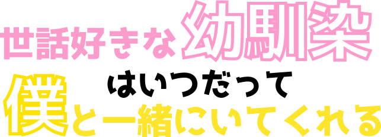

##work with osananajimi | kazuki-nishimura, aosatomiru

  

## 🐰このプロジェクトについて

幼馴染

## 🔥開発者たちの想い

## 👀このプロジェクトで用いられた音声ファイル

フリー声優の常盤はなこさんにご協力いただきました。

## Google スライド

<iframe src="https://docs.google.com/presentation/d/1bxQ6AGLWHZx9QcjvOI-KPH7xyOSC71Vy_93sML1UfU4/edit#slide=id.ge37fd24798_8_5" frameborder="0" width="500" height="569" allowfullscreen="true" mozallowfullscreen="true" webkitallowfullscreen="true"></iframe>

## :octocat:開発者たち

<table>
  <tr>
    <td align="center"><a href="https://github.com/kazuki-nishimura">
       
      <a href="https://github.com/kazuki-nishimura" title="Code">kazuki-nishimura</a></a></td>
    <td align="center"><a href="https://github.com/aosatomiru">
       <a href="https://github.com/aosatomiru" title="Code">aosatomiru</a></a></td>
  </tr>
</table>

