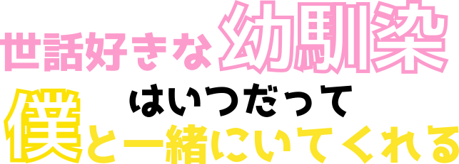

##work with osananajimi | kazuki-nishimura, aosatomiru

## 🐰このプロジェクトについて

幼馴染

## 🔥開発者たちの想い

## 👀このプロジェクトで用いられた音声ファイル

フリー声優の常盤はなこさんにご協力いただきました。

## :octocat:開発者たち

<table>
  <tr>
    <td align="center"><a href="https://github.com/kazuki-nishimura">
       
      <a href="https://github.com/kazuki-nishimura" title="Code">kazuki-nishimura</a></a></td>
    <td align="center"><a href="https://github.com/aosatomiru">
       <a href="https://github.com/aosatomiru" title="Code">aosatomiru</a></a></td>
  </tr>
</table>

